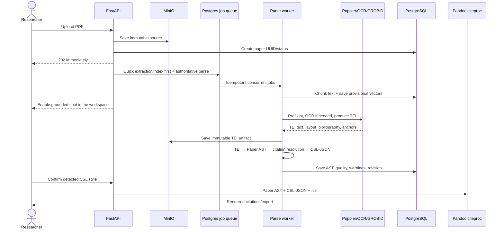
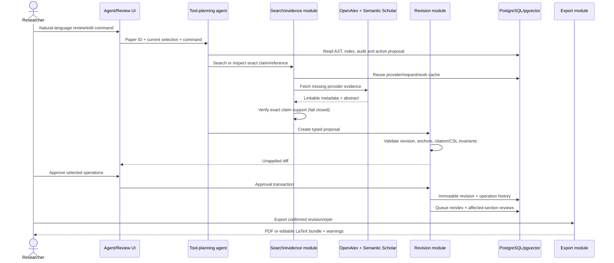

# Paper Review Agent

A citation-aware workspace that turns a PDF into a structured manuscript, checks missing and existing citations against real scholarly sources, proposes reviewable edits, and exports a CSL-rendered PDF or editable LaTeX bundle.

**[Watch the workflow screen recording — Part 1](https://cap.so/s/8r53cznnbmve09y)**

**[Watch the workflow screen recording — Part 2](https://cap.so/s/sd0gaef0t90jmcc)**

## Run

```bash
cp .env.example .env                 # set TAILSCALE_IP and OPENAI_API_KEY
docker compose up --build            # API, worker, PostgreSQL, MinIO, GROBID
cd frontend && bun install && bun run dev
```

The frontend runs at `http://127.0.0.1:5555`, the API at `http://$TAILSCALE_IP:3333`, and API docs at `/docs`. Do not upload confidential papers: this assessment build intentionally has no authentication or tenancy.

Railway deploys the API and worker from the connected Git repository. They share one image; Alembic runs before startup, while PostgreSQL, MinIO, and GROBID stay on private service URLs.

## System design

```text
React + SWR + TanStack AI ──HTTP / AG-UI SSE──> FastAPI
                                                   ├── PostgreSQL + pgvector: papers, indexes, findings, revisions, caches
                                                   ├── MinIO: immutable PDFs, TEI, and exports
                                                   └── PostgreSQL-backed BullMQ ──> workers
                                                                                   ├── GROBID / OCR / Poppler
                                                                                   ├── OpenAlex + Semantic Scholar
                                                                                   └── OpenAI
```

### Citation parsing and rendering

The durable conversion is: validate/store PDF → Poppler layout/text preflight → optional OCR for text-poor pages → GROBID TEI → normalized `Paper` AST → citation-target resolution → CSL-JSON bibliography → style detection/confirmation → Pandoc citeproc rendering. GROBID targets are preferred; numeric, author-year, and Harvard-key fallbacks run only when needed. Ambiguous or unresolved markers remain explicit AST nodes with raw text and warnings instead of being dropped.



Intermediate representations are intentionally explicit:

| Representation | Owns | Preserved uncertainty |
|---|---|---|
| Source PDF/TEI artifacts | Original bytes, coordinates and parser evidence | OCR/recovery steps and extraction failures |
| `Paper` AST | Sections, paragraphs, sentence spans, text/citation nodes and stable IDs | Raw unresolved markers, confidence, methods and warnings |
| CSL-JSON | Canonical bibliographic fields for every renderable reference | Partial/failed references retain raw bibliography text |
| Manuscript revision | Immutable hashed AST snapshot plus approved operations | Validation warnings and exact parent revision |

Parsing jobs have stable IDs, bounded exponential retries and durable stage status. The source PDF is never discarded on parse failure. A missing GROBID target is surfaced; low parse quality produces prominent warnings but currently does not hard-block review; missing CSL preserves the raw marker; an unconfirmed style blocks citation mutation/export. Provider/cache state cannot rewrite the canonical parsed bibliography.

### Agent, peer review and editing

The agent is a typed tool loop rather than one prompt. A paper-scoped command first reads the AST/index/audits, then chooses a narrow tool. Missing-work search and cited-work resolution cross one provider seam with OpenAlex and Semantic Scholar adapters; exact requests and normalized works are cached. Candidate support is judged only from provider title/abstract evidence and fails closed when evidence or verification is unavailable. Mutations return typed, unapplied operations; deterministic code—not the model—owns anchors, citation preservation, CSL rendering, proposal conflicts, approval and history.



Core invariants and failure behavior:

- One planned proposal per paper revision; closing its modal discards that modal-owned proposal, and unrelated proposals are never silently replaced.
- Existing citation nodes and section identities survive prose edits. General prose changes are extractive only; new sourced citations use verified provider works and CSL-rendered markers.
- Approval is transactional and creates the next immutable revision. Reindex/review runs after commit; queue failure becomes a visible warning and retryable stage, never a false approval failure.
- Search is local-cache first, then both providers with throttling, bounded retries and negative caching. No key/abstract/verifier means `unverifiable`, never actionable.
- OpenAlex and Semantic Scholar matches stay as provider-scoped evidence. They reconcile only on DOI, arXiv ID, or exact title/year/author identity; conflicts remain `ambiguous`, with abstract and identifier provenance preserved per provider.
- Provisional chat uses the fast vector index and receives live pipeline status on every request. It answers supported broad questions normally and names the exact unfinished stage only when structure, citations, review, or editing is not ready.
- Export reconstructs semantic AST content. Figures, tables, display equations, notes, captions, cross-references and page typography are not first-class nodes and may be omitted or flattened; every export warns the user to compare it with the source PDF.

## Decisions for fast interaction and reuse

- Upload enters the Agent-first workspace immediately. Chat unlocks after quick extraction, chunking, and vectorization; authoritative parsing, reference resolution, reviews, and re-indexing continue in the same workspace.
- Independent jobs run concurrently with stable IDs, bounded retries, stage-level status, and manual recovery.
- A paper's first successful parse persists its source PDF, raw TEI, Paper AST, quick/authoritative indexes, findings, and immutable revision history. Reopening its UUID reuses that state without parsing again.
- Provider responses are cached by exact request in PostgreSQL. Normalized scholarly works are deduplicated by provider IDs/DOI/title and searched locally before external calls, so sources discovered for one paper can support future papers.
- Repeat uploads receive a new paper UUID, but exact-PDF and strong DOI/arXiv/title identities hydrate prior provider matches before any external lookup.
- Papers over 80 pages still parse and support chat, but automated review is section-scoped to bound latency and cost.

## Trust and editing rules

- OpenAlex and Semantic Scholar are the only sources for suggested papers. A citation is insertable only when provider title/abstract evidence verifies support for the exact anchored claim.
- Citation form, locators, narrative markers, and bibliography layout are rendered by Pandoc citeproc from canonical CSL-JSON and a user-confirmed installed CSL style (APA, IEEE, and others), never handwritten marker templates.
- General prose edits are extractive tightenings: deterministic validation rejects introduced words or novel claims. Citation tools attach a verified source to an existing claim rather than inventing factual prose.
- Every mutation is a typed proposal. Nothing changes until explicit approval; approval creates an immutable hashed snapshot and supports selective revert or full restore.
- Approval commits the manuscript before refresh jobs are queued. A queue outage returns a warning and marks refresh work failed without turning a successful edit into a misleading HTTP error.
- Export is semantically faithful, not pixel-identical: Pandoc produces CSL citations and references, then LaTeX produces a PDF plus an editable bundle. Complex figures, equations, typography, and page layout may require restoration.

OpenAI is used for grounded chat, claim discovery, evidence classification, and constrained edit planning. Deterministic code owns PDF validation, AST anchors, provider provenance, CSL rendering, mutation validation, approval, and history.

## Assumptions and fixtures

GROBID is the authoritative parser; text-poor PDFs may use OCR. Review quality depends on provider metadata/abstract availability and configured API access (`OPENAI_API_KEY`; optional `OPENALEX_API_KEY`, `OPENALEX_MAILTO`, and `SEMANTIC_SCHOLAR_API_KEY`). The sample PDFs are open-access arXiv fixtures: Attention Is All You Need ([1706.03762](https://arxiv.org/abs/1706.03762)), BERT ([1810.04805](https://arxiv.org/abs/1810.04805)), and Language Models are Few-Shot Learners ([2005.14165](https://arxiv.org/abs/2005.14165)); their authors retain ownership.

Frontend primitives come from the Intent UI registry and licensed Beautiful UI components; registry metadata and the bundled [`LICENSE`](frontend/src/components/ui/LICENSE) are retained.

## Completely implemented with AI

1. Wiring the JavaScript TanStack AI frontend to the Python OpenAI backend.
2. Parsing GROBID XML into the JSON Paper AST.

## Validation

```bash
docker compose build api
docker compose run --rm api python -m unittest discover -s tests -v
cd frontend && bun run build
```

The backend suite contains 59 passing tests, including an architecture path from real TEI through dual-provider evidence reconciliation, fail-closed support verification, proposal, approval, citation-anchor preservation, CSL rendering, compiled PDF and editable export; it also covers provider conflicts, paper-scoped agent tools, grounded citation selection, approval recovery, parser/provider behavior, and three real-paper fixtures.
