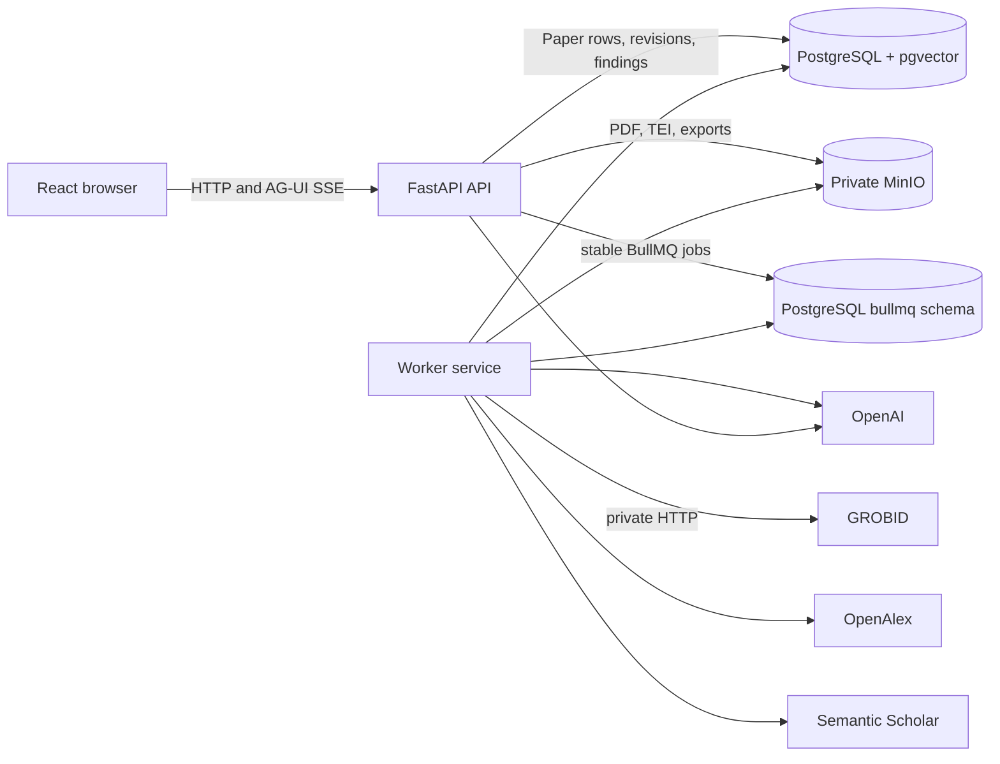
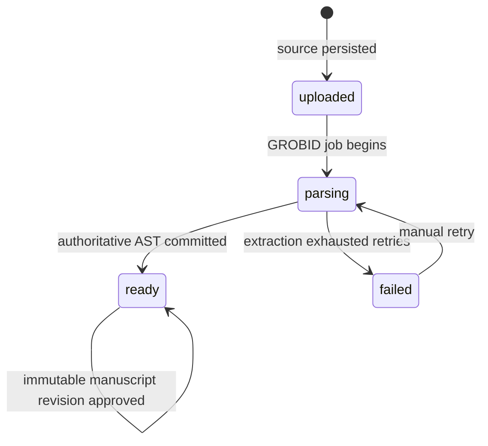
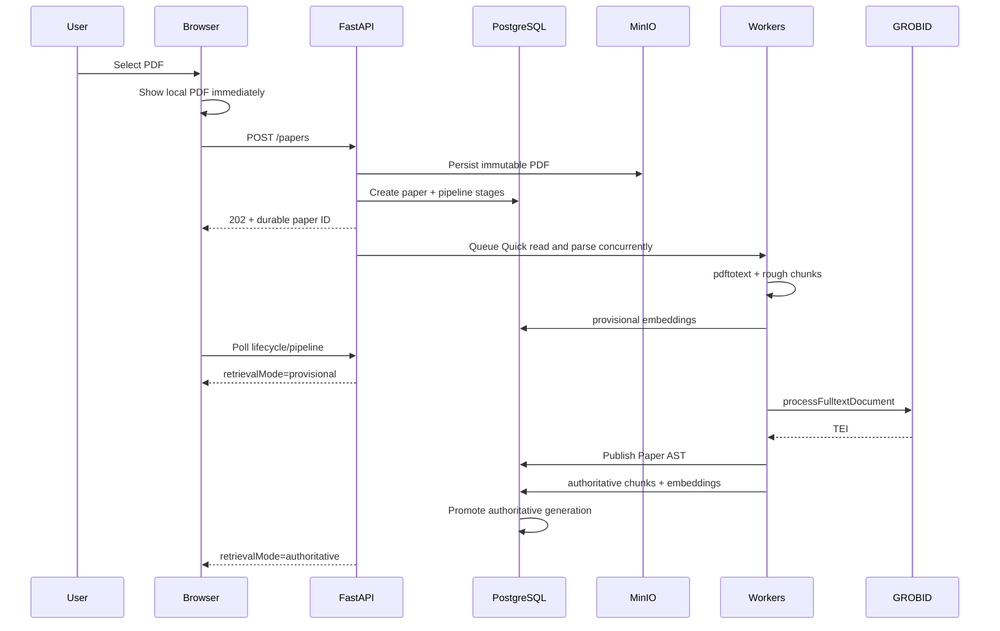
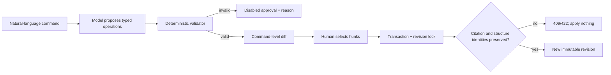
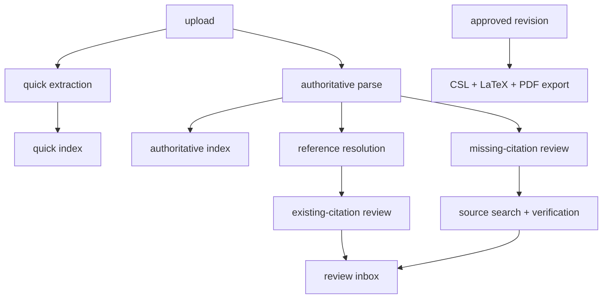

# System design

## Design goal

The product turns an uploaded research-paper PDF into a citation-aware peer-review workspace. The central design choice is progressive trust: rough text may answer broad questions quickly, but citation review, manuscript mutation, and export wait for the authoritative Paper AST produced by GROBID.

The browser is never the workflow coordinator. PostgreSQL stores every durable transition, BullMQ workers execute independent jobs, and a refreshed browser rebuilds the workspace from the paper URL.

## Service topology

Locally, Compose creates the same API, worker, PostgreSQL, MinIO, and GROBID boundaries. In Railway, services communicate through private internal URLs. `DATABASE_URL`, `GROBID_URL`, and `S3_ENDPOINT` must therefore point at their private services; only the API and frontend need public domains.

The API and worker use the same application image so extraction utilities, schema code, and export dependencies do not drift. Alembic runs as a pre-start migration service. Application releases reach Railway through the connected Git repository; the Railway CLI is used only for infrastructure, variables, logs, and diagnostics.

## Deep module boundaries

| Module | Public responsibility | Hidden decisions |
| --- | --- | --- |
| Artifact store | Save/read source PDF, TEI, and exports | MinIO bucket bootstrap, object keys, content types, local fallback |
| Paper documents | Create lifecycle, publish parse, serve current Paper | row locking, revision merging, source immutability |
| Pipeline repository | Begin, progress, complete, fail, skip, and list stages | timestamps, attempts, durable errors, ordering |
| Retrieval index | Build provisional/authoritative indexes and search best one | chunk identity, embeddings, pgvector promotion |
| Review services | Produce anchored missing-work and support findings | batching, provider evidence, confidence, model validation |
| Manuscript revisions | Plan, validate, approve, compare, restore, and revert | AST addressing, citation/structure invariants, transactions |
| Paper exports | Confirm style and create LaTeX/PDF artifacts | CSL processing, escaping, compilation, bundle layout |

Routers translate HTTP to these interfaces. Product components call hooks rather than orchestrating requests, polling, or upload XHR themselves.

## Durable paper state

`papers.paper_json` is the immutable parse baseline. `manuscript_revisions` contains complete immutable AST snapshots with hashes and parent revisions. `papers.manuscript_revision` selects the current snapshot. Reference enrichment has its own monotonic projection revision, so provider updates do not overwrite manuscript history.

The original PDF and raw TEI are immutable artifacts. Generated exports are keyed by paper and manuscript revision. Deleting a browser session does not delete or cancel any server work.

## Progressive ingestion and retrieval

Quick Read uses Poppler text extraction, rough chunks, OpenAI embeddings, and pgvector cosine search. Every Quick Read answer is labelled provisional and the UI keeps citation-sensitive controls locked. GROBID then provides stable section, paragraph, sentence, citation, and reference identities. Authoritative indexing creates a separate generation and atomically becomes the preferred search source; histories are not retroactively rewritten.

For a typical 20-page born-digital paper, the targets are PDF visibility under one second, Quick Read under five seconds, authoritative parse under 30 seconds, and the first verified finding under 45 seconds. Persisted stage timestamps expose actual worker runtime and attempts.

## PDF-to-Paper extraction

1. The API validates MIME/extension, PDF magic bytes, and the 50 MB limit.
2. Poppler preflight records page count, encryption, and whether selectable text is sparse.
3. OCRmyPDF runs only when enabled and preflight recommends OCR.
4. GROBID receives sentence-segmentation, stable-ID, raw-reference, and coordinate options.
5. Empty-body extraction retries with the configured fallback flavor.
6. A citation-bearing TEI without a bibliography triggers GROBID reference-only recovery and an explicit merge.
7. TEI normalization creates the typed Paper AST while retaining raw reference text, extraction pointers, unresolved fragments, and warnings.
8. Quality metrics decide whether the result is usable, usable with warnings, or unusable. The raw TEI remains downloadable for diagnosis.

GROBID consolidation is disabled. Provider identities are added through explicit OpenAlex/Semantic Scholar records so the provenance boundary remains visible.

## Citation model and review algorithms

CSL-JSON is the canonical bibliography representation. Paragraphs are ordered text and citation nodes; citation nodes hold one or more reference IDs, original marker text, resolution method, confidence, locators, and an exact paragraph anchor.

### Missing citations

The missing-citation lane does not ask a model to invent papers:

1. Extract stable sentences and prioritize quantitative, causal, comparative, empirical, association, and generalized claims.
2. Run a complete-body discovery lane alongside the heuristic lane so rule misses are still considered.
3. Validate every model span against exact source text before storing it.
4. Search the local scholarly-work table first, then OpenAlex and Semantic Scholar.
5. Deduplicate against the current bibliography by provider ID, DOI, arXiv ID, and normalized title.
6. Verify claim support from provider title/abstract evidence. Exact evidence substrings are retained.
7. Only a candidate with provider evidence, `support_status=verified`, and `supports_claim=true` can become an insertion proposal.

### Existing citation support

1. Extract each exact claim/citation/reference tuple from citation-bearing sentences.
2. Join the reference to persisted provider evidence.
3. Embed the claim and provider abstract; cosine similarity prioritizes processing but never decides support.
4. Classify compact batches as `supported`, `weak`, `contradicted`, or `unverifiable` using only supplied evidence.
5. Reject any returned evidence text that is not an exact substring of the provider abstract.
6. When evidence is absent, store `unverifiable` rather than inferring from title or model memory.

Both lanes produce exact paragraph anchors and provider links in one review inbox. A paper over 80 pages skips whole-document model review and asks the user to select at most five sections; parsing, indexing, and chat still complete.

## Constrained editing safety

One mode-free Agent conversation owns both questions and edit requests. The agent answers ordinary questions directly and invokes the proposal tool for manuscript changes; proposals expose only Approve and Discard actions and never apply automatically. Ordinary rewrite commands can propose `replace_text` inside the abstract or existing text nodes. History-aware commands can inspect every immutable snapshot and approved operation, then propose an exact inverse operation or a complete `restore_revision`. Explicit operation IDs in undo commands are matched deterministically against durable history, so a model cannot silently drop or invent the selected change. The replacement cannot introduce citation marker text or change section identity. Verified-source insertion uses a separate deterministic `insert_citation` operation that carries the provider-derived CSL item and an exact finding anchor; citation removal is allowed only when it is the explicit inverse of a known historical insertion.

Approval locks the current paper row and rejects stale base revisions. It applies all selected operations in memory, then compares section/paragraph identity and the complete citation identity set before committing; only explicitly selected historical citation inverses may reduce that set. No operation writes the manuscript directly. Every successful approval creates a new hashed snapshot; full restore and selective operation revert also create new revisions, so undo never deletes history.

## Citation rendering and export

Export is revision-specific and requires a confirmed installed CSL style. `citeproc-py` renders in-text citations and the bibliography from canonical CSL-JSON. The semantic renderer escapes LaTeX control characters, emits sections and paragraphs, then `pdflatex` compiles twice. The worker stores both:

- a ZIP containing `main.tex`, `references.json`, the exact CSL style, and reconstruction notes;
- the compiled PDF.

The export deliberately prioritizes semantic correctness over visual reconstruction. Missing CSL records remain warnings, unresolved citation markers fall back to their original text, and figures, equations, typography, and exact pagination are listed as manual-restoration risks. Compiler output uses loss-tolerant UTF-8 decoding, while common mathematical Unicode extracted from papers is mapped to safe LaTeX commands before `pdflatex` runs.

## Queue DAG and recovery

Jobs have deterministic IDs, bounded attempts, and exponential backoff. Stage state is stored independently from BullMQ internals, so a failed stage does not erase completed work. Workers commit enrichment and review batches incrementally. On worker startup, a source-search finding whose queue job exhausted under an older search implementation reprocesses that same idempotency key with reset attempt counters. A failure is stamped with the current search version so permanent failures are not retried on every restart. The UI exposes attempt count, duration, safe public errors, and manual retry for failed stages. Manual retry reuses the same semantic stage while issuing a fresh queue identity only after the prior job is gone.

## Failure and uncertainty behavior

| Failure | User-visible behavior | Preserved state |
| --- | --- | --- |
| GROBID unavailable/exhausted | Quick Read remains; citation-sensitive tools stay locked; retry offered | PDF, provisional index, failure details |
| One provider unavailable | Other provider/local cache can contribute; missing evidence is explicit | completed results and raw provider records |
| OpenAI key/model error | affected review/edit stage fails independently with retry | parse, index, other stages, prior findings |
| Worker restart | stable queued jobs resume; completed batches are skipped | database and MinIO state |
| Browser disconnect | no effect on workers | complete durable workflow |
| Stale edit proposal | approval returns conflict; nothing changes | current revision and proposal evidence |
| LaTeX compilation error | export record fails with a safe error | manuscript revision and other exports |

## Security and privacy

- The assessment intentionally has no authentication or tenancy. Paper IDs are UUIDs, not an authorization boundary.
- The upload screen warns against confidential manuscripts.
- PostgreSQL, MinIO, GROBID, and worker services are private; the API proxies source and export downloads.
- Secrets are service variables and never enter frontend bundles or logs.
- Model/provider input is minimized: coordinate-heavy extraction metadata and unrelated records are not sent.
- PDF, TEI, provider text, and model output are untrusted data. Typed schemas and exact-span checks prevent them from becoming instructions or executable operations.
- Production use requires authentication, per-tenant authorization, retention/deletion controls, malware scanning, rate limits, audit logging, and encryption policy.

## Scaling path

The current assessment uses one API and one worker process. Queue boundaries already permit independent scaling: parsing workers are CPU/memory heavy, provider workers are I/O bound, and model-review workers are cost/rate-limit bound. At higher load, split worker entry points by queue, assign GROBID its own memory class, add per-provider concurrency budgets, and keep PostgreSQL connection pools below service limits. MinIO can be replaced by any compatible private S3 store without changing paper services.

The durable schema is the control plane. BullMQ job state is operational; PostgreSQL pipeline rows are the product projection. This separation lets operators rebuild queue jobs from durable stage state if a queue schema is lost.

## Implementation map

- Lifecycle and projections: `app/repositories/papers.py`, `app/repositories/pipeline.py`
- Artifact adapters: `app/repositories/artifacts.py`
- Queue fan-out: `app/services/paper_ingestion.py`, `app/services/paper_pipeline.py`, `app/workers/`
- Paper normalization: `app/services/tei_parser.py`, `app/schemas/paper.py`
- Retrieval: `app/services/quick_read.py`, `app/services/paper_index.py`
- Review: `app/services/citation_audit.py`, `app/services/source_search.py`, `app/services/claim_citation_review.py`
- Editing: `app/services/manuscript_revisions.py`
- Export: `app/services/paper_exports.py`
- Workspace hooks/components: `frontend/src/hooks/`, `frontend/src/components/agent/`
